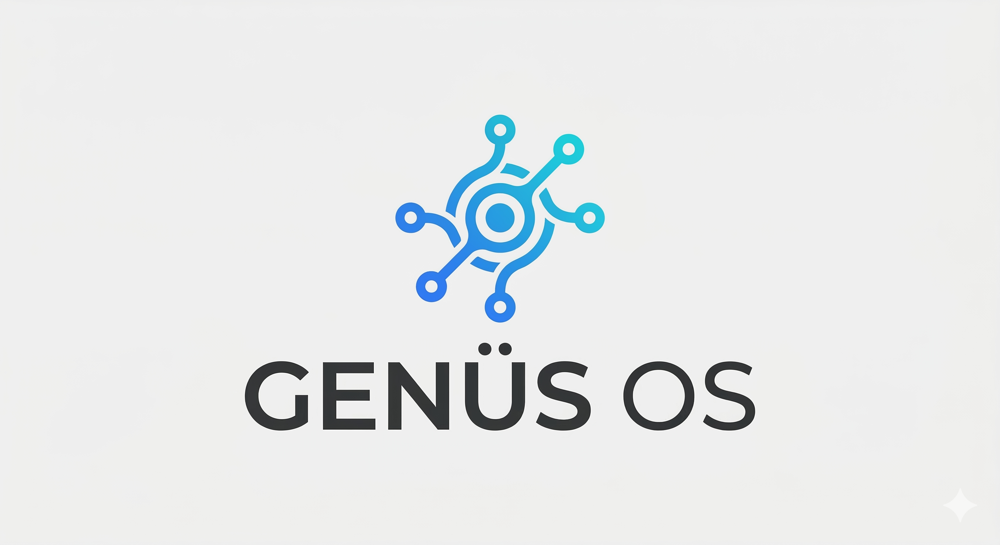

<p align="center">
  
</p>

<h1 align="center">Genus OS</h1>
<p align="center"><b>The enterprise AI operating system you deploy on your own infrastructure.</b></p>

<p align="center">
Define agents in YAML. Wire them into governed pipelines with audit trails and guardrails.
Federate across sites, teams, and subsidiaries with cryptographic trust and scoped permissions.
<br><br>
Enterprise security. Enterprise scalability. Enterprise governance.<br>
Your infrastructure. Your data. Your rules.
</p>

<p align="center">
  <a href="https://www.python.org/downloads/"></a>
  <a href="LICENSE"></a>
  <a href="https://github.com/Ironsail-llc/genus-os/actions/workflows/ci.yml"></a>
</p>

---

## Why Genus OS

Genus OS is a self-hosted agent operating platform for organizations that need
to own their runtime, data flows, policies, and deployment lifecycle. It can run
on-premises, in a private cloud, or in a deliberately configured air gap.

| Enterprise Need | How Genus OS Delivers |
|---|---|
| **Data sovereignty** | Core services run on your infrastructure. Local models can keep model traffic inside the deployment; configured cloud models, web search, messaging, and other connectors send data to their named providers. |
| **Security** | Vault/SOPS deployment options, signed dashboard sessions and scoped Bridge/Engine tokens, per-agent tool allow/deny lists, runtime guardrails, secret scanning, and cryptographic federation identity. |
| **Governance** | Structured agent-run, tool, policy, and task evidence; review workflows; approval boundaries; and OTel-compatible trace context. Audit coverage must be validated for each material workflow. |
| **Scalability** | Federate across sites, teams, and subsidiaries. Federation adds scoped connectivity between autonomous instances; it does not remove the single-writer Engine or other per-instance availability dependencies. |
| **Multi-tenancy** | Bridge identity, route authorization, and CRM access are tenant-scoped. Appliance-global and legacy memory paths have additional restrictions; add database-level isolation before hostile multi-tenant use. |
| **Compliance** | Capability mappings and deployer controls for regulated environments. These are not certifications; actual scope, configuration, operating evidence, contracts, and organizational controls determine compliance. |

## Highlights

**Governed Agent Platform** — Declarative YAML agent manifests, conditional
workflows, and a large registered tool catalog with per-agent allow/deny lists.
Twelve implemented guardrail policies cover destructive writes, external HTTP,
branch protection, rate limits, sensitive output, command/path restrictions,
desktop safety, approvals, and selected domain rules; three baseline policies
apply by default and higher-risk policies must be assigned deliberately.

**Enterprise Federation** — Connect Genus OS instances across sites, subsidiaries, and partners into a peer-to-peer mesh. Ed25519 signed invite tokens establish cryptographic trust. Each connection has scoped exports/imports — no implicit access, no transitive trust. Three-channel sync (critical/bulk/media) with Hybrid Logical Clocks for causal ordering across distributed instances. NATS JetStream transport with leaf-node topology handles unreliable networks gracefully. Every instance runs autonomously; federation adds connectivity, not dependency.

**The Helm (Control Plane)** — A Next.js 16 + Dockview control plane with 48
lazy-loaded components. Chat with agents, manage tasks, watch event streams, and
monitor fleet health. Human sessions use OIDC plus Bridge-issued identity, and
the Engine independently enforces signed, tenant-bound scopes. Model-generated
views are sanitized, isolated, and read-only; provider calls and credentials
remain in the Engine.

**Intelligence Layer** — Two-tier memory: working context and long-term facts
with hybrid search (HNSW vectors + BM25 keyword matching, fused by Reciprocal
Rank Fusion). Embedding, reranking, and generation can be fully local when the
deployment selects only local providers. Facts carry confidence, category, and
lifecycle metadata with quality gates.

**Physical Security** — YOLOv8 nano + InsightFace ArcFace for object detection
and face recognition, with disarmed/basic/armed runtime modes and RTSP camera
support. Vision stays local only when its configured analysis and alert
providers are local; operators are responsible for biometric/privacy policy,
consent, retention, and jurisdictional requirements.

**Desktop & Browser Automation** — Full computer-use capability with 13 desktop tools (screenshot, click, type, drag, scroll, window management, app launch) via Xvfb virtual display and VNC. Browser automation for web interactions. Agents can operate GUI applications autonomously — no human screen required.

**Inter-Agent Communication** — Agents coordinate via typed messages, team scratchpads, and shared working state. Teams form dynamically for multi-agent collaboration. Goal evidence and achievement metrics support review and improvement workflows.

**Operations & CRM** — Built-in CRM with cross-channel identity resolution and multi-tenancy. Task state machine (TODO &rarr; IN_PROGRESS &rarr; REVIEW &rarr; DONE) with SLA tracking, agent notifications, and human-in-the-loop approval workflows. Fleet analytics with anomaly detection. Nightwatch: overnight self-improving pipeline that diagnoses failures and opens draft PRs. sd_notify watchdog with DB/Redis health pings, zombie run reaping, and stale session cleanup. MCP server exposes 44 tools over stdio; agents can also call external MCP servers as clients. The repository includes SOPS/age, systemd, and Cloudflare Tunnel patterns whose controls depend on deployment configuration.

## Getting Started

1. **Clone and install:**
   ```bash
   git clone https://github.com/genusos/genusos.git
   cd genus-os
   python3 -m venv venv && source venv/bin/activate
   pip install -e ".[all]"
   ```

2. **Activate the onboarding guide:**
   ```bash
   cp docs/ONBOARDING.md CLAUDE.md
   ```

3. **Open Claude Code and ask:** "Help me get started"
   The guide walks through prerequisites, API keys, identity, agents, and first run.

4. When done, delete `CLAUDE.md` or replace with your own project instructions.

To build custom agents later:
```bash
cp docs/AGENT_BUILDER.md .claude/AGENT_BUILDER.md
```

## Quick Start

```bash
git clone https://github.com/genusos/genusos.git
cd genus-os
pip install -e ".[all]"
robothor init       # Interactive setup: DB, Redis, Ollama, migrations
robothor serve      # Start orchestrator + engine
```

Or with Docker for dependencies:

```bash
robothor init --docker   # PostgreSQL+pgvector, Redis, Ollama in containers
robothor serve
```

Engine and TUI commands:

```bash
robothor engine status   # Engine health, scheduler, bot status
robothor engine run <id> # Run any agent manually
robothor tui             # Terminal dashboard for monitoring
```

## Production status

The version 1.10 release-candidate change set contains a hardening foundation:
an ordered manifest of 83 checksum-verified migrations with upgrade archives,
separate liveness/readiness, persistent production workspaces, fail-closed
dashboard/Bridge/Engine authentication, constrained Kubernetes workloads,
release gates, encrypted snapshot/restore, and the first policy-bound Entity
Kernel treasury contracts.

That does not make an unconfigured checkout production-ready. Before go-live,
operators must provision Vault and OIDC, seed the agent workspace, validate
database TLS, configure monitoring and private ingress, schedule off-site
snapshots, complete a measured restore drill, and close or explicitly accept
every P0 item in the [production hardening TODO](docs/PRODUCTION_HARDENING_TODO.md).
The current single-writer engine also requires leader election or tested
active/passive failover before a 99.9% service commitment can be substantiated.
The 15-minute RPO and 60-minute RTO are likewise targets until a deployed
backup schedule and restore drill measure them.

This change set must be reviewed in a draft PR. Merge and deployment are
separate human-approved actions; opening the PR does not deploy it.

Useful operating references:

- [Snapshot and restore runbook](docs/runbooks/SNAPSHOT_RESTORE.md)
- [Entity Kernel treasury boundary](docs/ENTITY_KERNEL_TREASURY.md)
- [Payment-data boundary](docs/compliance/PAYMENT_DATA.md)
- [Security controls inventory](docs/compliance/SECURITY_CONTROLS.md)

Genus OS does not store raw PAN or CVC/CVV for either customers or the
organization's own cards. Customer flows use payment-provider tokens; Entity
spend uses provider-issued virtual-card references. Ownership does not remove
PCI scope, and this boundary is not a PCI certification or live payment adapter.

## Build Your Agents

Every agent is defined by a YAML manifest and an optional instruction file. Scaffold one, or drop a manifest in `docs/agents/` yourself.

```bash
robothor agent scaffold support-triage --description "Classify incoming support tickets"
```

This creates `docs/agents/support-triage.yaml` (manifest) and `brain/SUPPORT_TRIAGE.md` (instruction file) from templates. For a guided experience, use the Agent Builder wizard (`robothor agent build`) — it captures your intent, generates the manifest and instructions, and scaffolds an eval framework. Edit the result to fit your needs:

```yaml
# docs/agents/support-triage.yaml
id: support-triage
name: Support Triage
description: Classify incoming support tickets and route to the right team
version: "2026-03-01"
department: operations

model:
  primary: openrouter/moonshotai/kimi-k2.5
  fallbacks:
    - openrouter/anthropic/claude-sonnet-4.6
    - gemini/gemini-2.5-pro

schedule:
  cron: "*/30 8-20 * * 1-5"
  timezone: America/New_York
  timeout_seconds: 300
  max_iterations: 15
  session_target: isolated

delivery:
  mode: none              # Silent worker — no user-facing output

# Event hooks — primary trigger path (cron serves as safety net)
hooks:
  - stream: support
    event_type: ticket.new
    message: "New support ticket received. Classify and route."

tools_allowed:
  - exec
  - read_file
  - write_file
  - search_memory
  - create_task
  - list_tasks
  - resolve_task
tools_denied:
  - delete_task

task_protocol: true       # Must follow: list_my_tasks → process → resolve
status_file: brain/memory/support-triage-status.md
instruction_file: brain/SUPPORT_TRIAGE.md
bootstrap_files:
  - brain/AGENTS.md
  - brain/TOOLS.md

downstream_agents:
  - support-engineer
  - account-manager
tags_produced: [support, routing, escalation]
```

### Contracts

Agents are built against two strict contracts:

| Contract | File | Enforced by |
|----------|------|-------------|
| Manifest schema | `docs/agents/schema.yaml` | `validate_agents.py`, pre-commit hook, engine startup |
| Instruction format | `docs/agents/INSTRUCTION_CONTRACT.md` | Convention (AI-readable) |

Required manifest fields: `id` (kebab-case), `name`, `description`, `version` (YYYY-MM-DD), `department`.

### Manifest Fields

| Field | Purpose |
|-------|---------|
| `model.primary` / `fallbacks` | LLM with ordered fallback chain. Broken models auto-removed per run. |
| `schedule.cron` | APScheduler cron expression. Leave empty for hook-only agents. |
| `delivery.mode` | `announce` (delivers to user) or `none` (silent worker). |
| `tools_allowed` / `tools_denied` | Per-agent tool access. The engine strips tools not in the allow list before sending to the LLM. |
| `hooks` | Event triggers from Redis Streams. Primary fast path; cron as safety net. |
| `task_protocol` | Agent must check its inbox, process tasks, and resolve them. |
| `warmup.context_files` | Files pre-loaded into context before each run. |
| `streams.read` / `write` | Redis Streams the agent can subscribe to or publish on. |
| `instruction_file` | Markdown file loaded as the system prompt. |
| `bootstrap_files` | Shared context files appended after instructions. |
| `downstream_agents` | Agents this one creates tasks for. |
| `sla` | Response time targets by priority level. |
| `review_workflow` | If true, tasks go to REVIEW for supervisor approval. |
| `messaging` | Enable inter-agent messaging and team scratchpads. |
| `lifecycle_hooks` | Event-driven hooks (on_start, on_complete, on_failure) with handler types: command, http, agent, python. |

Full schema: [schema.yaml](docs/agents/schema.yaml) | Reference: [Agent Builder](docs/AGENT_BUILDER.md)

### Agent Lifecycle

```bash
robothor engine list           # See all scheduled agents
robothor engine run <id>       # Run one manually
robothor engine history        # Recent runs with status and duration
python scripts/validate_agents.py --agent <id>  # Validate manifest
```

The engine provides **110+ tools** — CRM operations, memory search, file I/O, shell execution, web fetch, task coordination, git operations, voice calling, desktop automation, browser control, inter-agent messaging, Apollo.io enrichment, MCP client calls, experiment/benchmark tracking, and more. Each agent sees only the tools in its `tools_allowed` list.

### Agent Engine v2

The engine's execution loop includes a full suite of runtime enhancements, all opt-in via the `v2:` manifest key:

- **Planning phase** — Generates an execution plan before acting, with dynamic replanning on new information
- **Working memory scratchpad** — Persistent scratch space across iterations for intermediate reasoning
- **Token and cost budgets** — Engine-side limits bound configured runs; keep provider-side caps and billing alerts because not every external charge is under the runner's control
- **Graduated escalation** — 3 consecutive errors → retry with feedback, 4 → checkpoint + replan, 5 → abort with diagnostics
- **Mid-run checkpoints** — Save and resume from any iteration via `POST /api/runs/{id}/resume`
- **Self-validation** — Post-execution verification step checks whether the agent's output satisfies the original goal
- **Difficulty-aware routing** — Routes simple tasks to smaller models (capped iterations), complex tasks to capable models

### Sub-Agents

Agents can spawn focused sub-tasks mid-run and receive structured results synchronously. Enable in the manifest:

```yaml
v2:
  can_spawn_agents: true
  max_nesting_depth: 3
  sub_agent_max_iterations: 10
  sub_agent_timeout_seconds: 120
```

Child agents inherit the parent's remaining budget (never exceed it), delivery is forced to `none`, and dedup keys are namespaced under the parent run. The `spawn_agents` tool runs multiple sub-agents concurrently (up to 3).

### Inter-Agent Messaging

Agents can communicate directly without spawning sub-agents:

| Tool | Purpose |
|------|---------|
| `send_agent_message` | Send a typed message to another agent |
| `receive_agent_messages` | Check inbox for messages from other agents |
| `create_team` | Form a dynamic team for multi-agent collaboration |
| `team_scratchpad_write` | Write to a shared team scratchpad |
| `team_scratchpad_read` | Read from a shared team scratchpad |

### MCP Client

Agents can call external MCP servers as clients, extending their capabilities dynamically:

```yaml
tools_allowed:
  - mcp_list_servers    # Discover available MCP servers
  - mcp_list_tools      # List tools on a specific server
  - mcp_call_tool       # Invoke a tool on an external MCP server
  - mcp_read_resource   # Read a resource from an MCP server
```

## Workflows

Multi-step pipelines defined in YAML. Triggered by events, backed by cron safety nets.

```yaml
# docs/workflows/support-pipeline.yaml
id: support-pipeline
name: Support Pipeline
description: Triage tickets, then route to engineer or account manager

triggers:
  - type: hook
    stream: support
    event_type: ticket.new
  - type: cron
    cron: "0 9-17/4 * * 1-5"

steps:
  - id: triage
    type: agent
    agent_id: support-triage
    message: "New ticket received. Classify and route."
    on_failure: abort

  - id: check_priority
    type: condition
    input: "{{ steps.triage.output_text }}"
    branches:
      - when: "'escalation' in value.lower()"
        goto: escalate
      - when: "'technical' in value.lower()"
        goto: engineer
      - otherwise: true
        goto: acknowledge

  - id: escalate
    type: agent
    agent_id: account-manager
    message: "High-priority ticket escalated. Review and respond."

  - id: engineer
    type: agent
    agent_id: support-engineer
    message: "Technical ticket assigned. Investigate and resolve."

  - id: acknowledge
    type: agent
    agent_id: support-triage
    message: "Non-critical ticket. Send acknowledgment and add to backlog."
```

**Event hooks** on Redis Streams are the primary trigger. Cron schedules serve as safety nets at relaxed frequencies. The workflow engine handles conditional branching, failure modes (`abort` / `skip`), and step chaining.

```bash
robothor engine workflow list      # List loaded workflows
robothor engine workflow run <id>  # Execute manually
```

## Nightwatch

A self-improving pipeline that runs overnight via Claude Code CLI in isolated git worktrees — no engine agent loop involved. Three specialized scripts:

1. **nightwatch-heal.py** (nightly, 3 AM) — Self-healing: detects failures, diagnoses root causes, and applies fixes in an isolated worktree. Opens draft PRs on feature branches.
2. **nightwatch-build.py** (Monday, 3 AM) — Feature builds: picks up approved improvement proposals and implements them end-to-end, including tests.
3. **nightwatch-research.py** (Sunday, 1 AM) — Competitive research: surveys the landscape, evaluates new tools and techniques, and writes structured reports.

All three run in isolated git worktrees and propose changes through draft PRs.
Repository rulesets and required reviewers must be configured by the operator;
the worktree alone is not branch protection. Draft PRs are labeled
`nightwatch` for filtering. A **Failure Analyzer** agent (every 2h) classifies
recent failures and creates CRM tasks that feed into the heal pipeline.

## The Helm

Not a dashboard — a control plane. Built with Next.js 16 and Dockview for a paneled, IDE-like layout.

<p align="center">
  
</p>

- **Chat** — Talk to agents through the Engine via SSE streaming
- **Task Board** — Kanban with drag-and-drop, approve/reject workflow
- **Event Streams** — Real-time feed from all Redis Streams
- **Agent Status** — Live health, run history, and error tracking
- **CRM Views** — Contacts, companies, conversations, notes
- **Service Health** — System topology with status indicators
- **Component Registry** — 48 lazy-loaded components, add your own

Model-generated dashboard documents are static, read-only presentation. They
cannot contain scripts, links, forms, controls, event handlers, network calls,
or an action channel. Native, authenticated UI routes remain the only dashboard
mutation path. The dashboard sends its verified Bridge bearer identity to a
same-tenant Engine completion endpoint; model selection and provider secrets do
not enter the Next.js process.

## The CRM

How agents coordinate. Native PostgreSQL tables — no external CRM dependency.

- **Task state machine** — TODO &rarr; IN_PROGRESS &rarr; REVIEW &rarr; DONE with structured task evidence and SLA tracking; validate audit completeness for each workflow
- **Agent notifications** — Typed messages between agents (task assigned, review requested, blocked, errors)
- **Cross-channel identity** — A single contact resolved across email, Telegram, voice, web, and API
- **Multi-tenancy** — Bridge middleware verifies tenant identity and enforces route scopes. Global/legacy paths are restricted, and database row-level security or equivalent isolation is still required before hostile multi-tenant use.
- **Merge tools** — Deduplicate contacts and companies. Keeper absorbs loser's data, re-links all records.
- **Goal and achievement scoring** — Per-agent goals, evidence, reviews, and achievement snapshots support improvement workflows.

## Memory

Two tiers of persistent memory stored in the deployment database. Embedding,
reranking, and generation remain local only when local providers are selected:

| Tier | Storage | Lifetime | Purpose |
|------|---------|----------|---------|
| Working | Context window + memory blocks | Session | Current conversation state, persona, user profile |
| Long-term | PostgreSQL + pgvector | Permanent | Importance-scored facts with hybrid search |

**Hybrid search:** HNSW vector index (m=16, ef=200) for semantic similarity, BM25 keyword matching via tsvector for exact terms, fused by Reciprocal Rank Fusion (`1/(60+rank)`). Top results pass through a cross-encoder reranker before delivery.

Configured ingestion pipelines can extract facts from email, calendar,
conversations, and vision events. Each fact carries confidence, category,
entity, and lifecycle metadata. Quality gates reject selected vague or generic
extractions; lifecycle jobs support decay, consolidation, and pruning.

```python
from robothor.memory.facts import store_fact, search_facts

# Store with confidence, category, and entity links
fact_id = await store_fact(
    fact={"fact_text": "Acme renewed for 2 years", "category": "deal",
          "confidence": 0.95, "entities": ["Acme Corp"]},
    source_content="email from sales",
    source_type="email",
)

# Hybrid search (vector + BM25 + reranker)
results = await search_facts("Acme contract status", limit=5)
```

**RAG stack:** Qwen3-Embedding &rarr; pgvector (HNSW) + BM25 &rarr; RRF &rarr; Qwen3-Reranker &rarr; LLM generation. This stack can be fully local when every configured model and connector is local.

## Vision

Continuous camera monitoring with runtime mode switching is supported when the
vision service and camera source are operated continuously:

| Mode | Behavior |
|------|----------|
| Disarmed | Idle — no processing |
| Basic | Motion &rarr; YOLO &rarr; InsightFace &rarr; instant alerts + async VLM analysis |
| Armed | Per-frame tracking with full detection pipeline |

**Pipeline:** Motion detection &rarr; YOLOv8 nano (6 MB) &rarr; InsightFace ArcFace (300 MB) &rarr; pluggable alerts. Alert latency depends on hardware, model, channel, and network configuration and must be measured in the deployment. Scene analysis can use a local vision model; remote providers change the data boundary. Runtime mode changes do not require a process restart.

## Desktop Automation

Full computer-use capability — agents can operate GUI applications on a headless virtual display without a human screen.

| Tool | Purpose |
|------|---------|
| `desktop_screenshot` | Capture the virtual display |
| `desktop_click` / `double_click` / `right_click` | Mouse interactions |
| `desktop_type` / `desktop_key` | Keyboard input |
| `desktop_drag` / `desktop_scroll` | Drag-and-drop, scrolling |
| `desktop_window_list` / `desktop_window_focus` | Window management |
| `desktop_launch` | Launch applications |
| `desktop_describe` | Vision-based screen description |

**Infrastructure:** Xvfb provides a virtual framebuffer (no physical display required). VNC exposes the display for remote monitoring. The `computer-use` agent manifest pre-configures all 13 desktop tools.

**Browser automation** is available via the `browser` tool for web-based interactions.

## Apollo.io Integration

Contact enrichment and company research via Apollo.io's API:

| Tool | Purpose |
|------|---------|
| `apollo_search_people` | Search contacts by name, title, company |
| `apollo_enrich_person` | Full profile enrichment (email, phone, social, role) |
| `apollo_search_companies` | Company discovery by industry, size, tech stack |
| `apollo_enrich_company` | Full company profile (funding, employee count, tech) |

Results feed directly into the CRM via the `crm-enrichment` agent.

## AutoResearch

An iterative metric optimization system for running structured experiments:

```yaml
tools_allowed:
  - experiment_create    # Define hypothesis, metric, variants
  - experiment_measure   # Record observations
  - experiment_commit    # Lock in winning variant
  - experiment_status    # Check running experiments
```

The `auto-researcher` agent uses these tools to test hypotheses, track metrics, and commit improvements. Paired with `benchmark_define`, `benchmark_run`, and `benchmark_compare` for agent performance benchmarking.

## Federation

Genus OS federation connects autonomous instances across offices, data centers,
subsidiaries, and partner organizations into a peer-to-peer mesh with explicit
exports and imports. Federation does not provide automatic workload failover,
complete replication, or high availability inside an instance.

### Use Cases

| Scenario | Topology |
|---|---|
| **Multi-site enterprise** | HQ hub with branch office leaf nodes. HQ pushes config and knowledge; branches report health, escalate tasks, and sync CRM data. |
| **Subsidiary governance** | Parent company connects to subsidiary instances as "parent." Scoped exports push compliance policies; scoped imports surface subsidiary health and alerts without exposing operational data. |
| **Partner integration** | Two organizations connect as "peers" with explicitly negotiated exports/imports. Share only what's agreed — no implicit access, no transitive trust. |
| **Dev/staging/production** | Federate staging instances to production for config sync and telemetry aggregation. Staging pushes test results; production pushes config templates. |
| **Disaster recovery** | A remote peer can continue its own workloads if another site fails. Recovery of the failed site's workloads and data is not automatic; replication scope, restore, traffic failover, and continuity must be designed and tested separately. |

### How It Works

```bash
# On the parent instance:
robothor federation init              # Generate Ed25519 identity
robothor federation invite --relationship child --ttl 48
# → prints a one-time signed token

# On the new instance:
git clone https://github.com/genusos/genusos.git
cd genus-os && pip install -e ".[all]"
robothor init
robothor federation init
robothor federation connect <token>   # Establishes bilateral connection
robothor engine start
```

### Architecture

Each connection has a **relationship** (parent, child, or peer) that sets default capability templates, **exports/imports** for scoped data sharing, and a **state machine** (pending → active → limited/suspended).

| Relationship | Parent Exports | Child Exports |
|---|---|---|
| Parent ↔ Child | Memory search, CRM read, config push | Health, agent runs, sensor data, alerts, escalation |
| Peer ↔ Peer | Explicitly negotiated | Explicitly negotiated |

### Security Model

- **Ed25519 cryptographic identity** — every instance has a unique keypair; invite tokens are signed to prevent tampering
- **One-time tokens** — each invite generates a unique connection secret (SHA-256 hashed), single use
- **Scoped permissions** — exports and imports are explicit per connection; no blanket access
- **No transitive trust** — A↔B and B↔C does NOT mean A↔C; every link is bilateral and independently authorized
- **Private key isolation** — keys stored with `0600` permissions, never transmitted
- **NATS account isolation** — each connection gets its own subject namespace

### Sync Protocol

Three prioritized channels with Hybrid Logical Clocks for causal ordering:

| Channel | Contents | Priority |
|---|---|---|
| Critical | Tasks, config, memory facts, alerts | Sync first |
| Bulk | Agent runs, tool calls, telemetry | When bandwidth allows |
| Media | Images, audio, documents | Background |

Conflict resolution uses monotonic lattices (task states only move forward), additive merges (memory facts), and authoritative sources (config from exporting instance).

**Transport:** NATS with JetStream for reliable, store-and-forward messaging. Hub instances run a full NATS server; leaf instances connect via NATS leaf nodes. Designed for unreliable networks — JetStream buffers messages during disconnections and replays on reconnect.

Full architecture: [docs/FEDERATION.md](docs/FEDERATION.md)

## Enterprise Security

Security is not a feature — it's the foundation. Genus OS is designed for environments where data breaches, unauthorized access, and uncontrolled AI behavior are existential risks.

| Layer | Controls |
|---|---|
| **Secrets management** | Kubernetes deployments split database, cache, signing, SSO/OIDC, dashboard, and provider trust classes into independently rotatable HashiCorp VSO paths with enforced per-component references. Dashboard and migrations cannot request privileged/provider classes. Systemd deployments can use SOPS + age and tmpfs. Operators still own provisioning, rotation, backup, and audit. |
| **Agent sandboxing** | Per-agent `tools_allowed` / `tools_denied` lists are enforced at the engine level. Twelve available runtime policies constrain destructive writes, HTTP, branches, rate limits, secret output, commands, paths, desktop actions, approvals, and selected domains. Policy assignment still requires threat modeling. |
| **Event bus RBAC** | Redis Streams with consumer groups. Agents can only subscribe to and publish on streams declared in their manifest. |
| **Network isolation** | Production chart values default-deny pod ingress and egress, then allow the component graph, selector-scoped DNS, and exact operator-supplied destination CIDRs/ports. Unrestricted CIDRs fail rendering; dashboard external egress is IdP-only. Air-gapped operation requires local models and disabling every external connector. |
| **Federation security** | Ed25519 cryptographic identity per instance. Signed one-time invite tokens. Scoped exports/imports with no transitive trust. NATS account isolation per connection. Private keys stored with `0600` permissions, never transmitted. |
| **Infrastructure** | Kubernetes and systemd deployment models provide health checks and restart behavior. TLS termination, trusted database CA material, monitoring, backup storage, and external access policy remain deployment controls. |

## Enterprise Governance

Genus OS emits structured evidence for core agent and policy activity. Treat
audit completeness as a workflow-specific property to test, not a blanket
claim that every possible side effect is captured.

| Capability | Detail |
|---|---|
| **Audit trails** | Agent runs and many tool, authentication, guardrail, task, and treasury events record structured actor, timing, outcome, and correlation data. Material integrations must add and test their own coverage. |
| **Human-in-the-loop** | Task review workflows require human approval before agents can proceed. Configurable per agent via `review_workflow: true` in the manifest. |
| **SLA tracking** | Tasks carry priority-based SLA targets. The system tracks time-to-resolution and flags breaches. |
| **Cost controls** | Per-run token/cost budgets and fleet caps bound normal execution. External provider limits and billing alerts remain necessary defense in depth. |
| **Graduated escalation** | Configured repeated-error thresholds can retry, checkpoint/replan, or abort with diagnostics; external side effects and alert delivery still need independent monitoring. |
| **Distributed tracing** | OTel-compatible trace context propagated across agent runs, sub-agent spawns, and federated operations. Plug into Jaeger, Grafana Tempo, or any OTel collector. |
| **Fleet analytics** | Cross-agent performance metrics, anomaly detection (rolling baselines, >2σ flagging), and failure pattern clustering. |
| **Change management** | Agent manifests are declarative YAML checked into version control. Local validation and CI check the schema; protected-branch rules and required PR review must be configured in the repository host. |
| **Multi-tenancy** | CRM data and verified Bridge identity are tenant-scoped. Deployers should add database row-level security or equivalent defense in depth before hostile multi-tenant use. |

## Architecture

```
┌─────────────────────────────────────────────────────────┐
│  The Helm                                                │
│  Control plane: chat, tasks, events, agents, CRM, health │
└────────────────────────┬────────────────────────────────┘
                         │
┌────────────────────────┴────────────────────────────────┐
│  Agent Engine                                            │
│  YAML manifests · workflow pipelines · 110+ tools        │
│  APScheduler · Redis Stream hooks · Telegram delivery    │
│  v2: guardrails · planning · checkpoints · telemetry    │
│  sub-agents · analytics · Nightwatch                     │
└────────────────────────┬────────────────────────────────┘
                         │
┌────────────────────────┴────────────────────────────────┐
│  Intelligence Layer                                      │
│                                                          │
│  ┌──────────┐ ┌──────────┐ ┌──────────┐ ┌────────────┐│
│  │ Memory   │ │ CRM      │ │ Vision   │ │ Events     ││
│  │ Facts    │ │ Contacts │ │ YOLO     │ │ Redis      ││
│  │ Entities │ │ Tasks    │ │ Faces    │ │ Streams    ││
│  │ RAG      │ │ Identity │ │ VLM      │ │ RBAC       ││
│  └──────────┘ └──────────┘ └──────────┘ └────────────┘│
│  ┌────────────────────────────────────────────────────┐│
│  │ Voice: Twilio inbound/outbound · Gemini Live · TTS ││
│  └────────────────────────────────────────────────────┘│
│                                                          │
│  PostgreSQL 16 + pgvector  ·  Redis 7  ·  Ollama        │
└─────────────────────────┬────────────────────────────────┘
                          │
┌─────────────────────────┴────────────────────────────────┐
│  Federation                                               │
│  NATS JetStream · Ed25519 tokens · HLC sync · Leaf nodes │
│  Connects independent instances with scoped permissions   │
└──────────────────────────────────────────────────────────┘
```

## Project Structure

```
robothor/
├── robothor/               # Python package — the intelligence layer
│   ├── engine/             # Agent Engine: runner, tools, scheduler, hooks, workflows,
│   │   ├── tools/          #   110+ tools organized by handler module (26 handlers)
│   │   └── tests/          #   analytics, guardrails, planner, telemetry, sub-agents
│   ├── memory/             # Two-tier memory, facts, entities, lifecycle
│   ├── rag/                # Semantic search, reranking, context assembly
│   ├── crm/                # Models, validation, blocklists
│   ├── vision/             # YOLO detection, InsightFace recognition, alerts
│   ├── events/             # Redis Streams, RBAC, consumer workers
│   ├── api/                # MCP server (44 tools), RAG orchestrator
│   ├── federation/         # Peer-to-peer instance networking (identity, sync, NATS)
│   ├── health/             # Garmin health data sync
│   └── cli.py              # CLI entry point
│
├── app/                    # The Helm (Next.js 16, React 19, Dockview)
├── crm/                    # CRM stack: Bridge service, migrations, Docker Compose
├── docs/
│   ├── agents/             # Agent schema, instruction contract, and tracked examples
│   └── workflows/          # 5 declarative workflow pipelines
├── brain/                  # Scripts, voice, vision, agent instructions
├── scripts/                # Backup, validation, Nightwatch scripts
└── templates/              # Bootstrap templates for new instances
```

## CLI Reference

| Command | Purpose |
|---------|---------|
| `robothor init` | Interactive setup wizard |
| `robothor serve` | Start orchestrator + engine |
| `robothor status` | System health overview |
| `robothor migrate` | Run database migrations |
| `robothor mcp` | Start MCP server (44 tools, stdio) |
| `robothor tui` | Terminal monitoring dashboard |
| `robothor agent scaffold <id>` | Scaffold a new agent (manifest + instruction file) |
| `robothor engine start` | Start the engine daemon |
| `robothor engine stop` | Stop the engine |
| `robothor engine status` | Engine health, scheduler, bot |
| `robothor engine run <id>` | Run an agent manually |
| `robothor engine list` | List all scheduled agents |
| `robothor engine history` | Recent agent run history |
| `robothor engine workflow list` | List loaded workflows |
| `robothor engine workflow run <id>` | Execute a workflow manually |
| `robothor federation init` | Generate instance identity (Ed25519 keypair) |
| `robothor federation invite` | Generate signed invite token for a peer |
| `robothor federation connect <token>` | Accept connection from a peer |
| `robothor federation status` | Show identity and all connections |
| `robothor snapshot create` | Create an encrypted database/workspace recovery point |
| `robothor snapshot list` | Inventory snapshots without decrypting them |
| `robothor snapshot verify <file>` | Authenticate and verify snapshot contents and compatibility |
| `robothor snapshot restore <file>` | Produce a restore plan; requires explicit flags to mutate state |
| `robothor snapshot prune` | Dry-run or apply bounded local retention |

## Deployment Models

Genus OS supports several deployment shapes. Whether a deployment has cloud or
vendor dependencies is determined by its selected model, search, messaging,
identity, payment, storage, and ingress providers.

| Deployment | Description |
|---|---|
| **Single server** | All services on one machine. Suitable for teams, departments, or small organizations. |
| **Federated multi-site** | Autonomous instances at each site, connected via federation. HQ aggregates health and pushes policy; branches operate independently. |
| **Air-gapped** | Possible with local models, private dependencies, and every external connector disabled or replaced. Validate images, packages, identity, time, updates, and federation inside the offline boundary. |
| **Hybrid cloud** | On-prem instances for sensitive workloads, cloud instances for scale-out. Federation bridges the gap with scoped permissions. |
| **Dev/staging/prod** | Separate instances per environment, federated for config sync and telemetry aggregation. |

### Hardware Requirements

| | Minimal | Recommended | Full Stack |
|--|---------|-------------|------------|
| **Use case** | Cloud APIs, no vision | Local small models, RAG, agents | Local 70B+ models, vision, all services |
| **RAM** | 8 GB | 32 GB | 128 GB (unified memory preferred) |
| **Storage** | 256 GB | 512 GB | 1 TB+ |
| **GPU** | None needed | Optional | Integrated or discrete |
| **CPU** | 4 cores | 8+ cores | 16+ cores |
| **Local models** | None (API only) | 7-13B quantized | Up to 80B on-demand |

## Configuration

All configuration via environment variables with sensible defaults:

| Variable | Default | Description |
|----------|---------|-------------|
| `ROBOTHOR_WORKSPACE` | `~/robothor` | Working directory |
| `ROBOTHOR_DB_HOST` | `127.0.0.1` | PostgreSQL host |
| `ROBOTHOR_DB_NAME` | `robothor_memory` | Database name |
| `ROBOTHOR_REDIS_HOST` | `127.0.0.1` | Redis host |
| `ROBOTHOR_OLLAMA_HOST` | `127.0.0.1` | Ollama host |
| `EVENT_BUS_ENABLED` | `true` | Enable Redis Streams event bus |

## Infrastructure

The repository includes Kubernetes/Helm, Docker Compose, and systemd patterns.
Cloudflare Tunnel and SOPS + age describe one supported systemd deployment;
Kubernetes production values use private ingress, NetworkPolicy, and HashiCorp
Vault Secrets Operator. None of these external controls is automatically
provisioned by installing the Python package.

| Service | Purpose |
|---------|---------|
| Agent Engine | LLM runner, scheduler, Telegram bot, event hooks |
| RAG Orchestrator | Semantic search and retrieval API |
| Bridge | CRM API, contact resolution, webhooks, multi-tenancy |
| Vision | YOLO + InsightFace detection loop |
| Voice Server | Twilio inbound/outbound calls + Gemini Live + Kokoro TTS |
| SMS Server | Twilio SMS webhook handler |
| The Helm | Live control plane dashboard |
| NATS Server | Federation transport (JetStream, leaf nodes) |
| Xvfb + VNC | Virtual display for desktop automation (computer use) |
| MediaMTX | RTSP/HLS camera streaming |
| Cloudflare Tunnel | Optional ingress pattern; route exposure and Access policies are deployment-specific |

**Local models (Ollama):**

| Model | Size | Role |
|-------|------|------|
| llama3.2-vision:11b | 7.8 GB | Vision scene analysis |
| qwen3-embedding:0.6b | 639 MB | Dense vector embeddings (1024-dim) |
| Qwen3-Reranker-0.6B:F16 | 1.2 GB | Cross-encoder reranking |
| qwen3:8b | 5.2 GB | Local fallback (watchdog, lightweight tasks) |

## Testing

```bash
pip install -e ".[dev]"
pytest tests/ robothor/ -m "not integration and not llm and not slow and not e2e"
pytest crm/bridge/tests/ -m "not integration and not slow and not e2e"
python scripts/validate_agents.py --ci
cd app && pnpm lint && pnpm exec tsc --noEmit && pnpm test && pnpm build
cd app && pnpm exec playwright test
helm unittest helm/genus-os --strict
```

The authoritative result is the required CI/release gate, not a static test
count in documentation. See [TESTING.md](docs/TESTING.md) for markers and test
strategy.

## Contributing

See [CONTRIBUTING.md](CONTRIBUTING.md) for coding standards, PR process, and architecture details.

### Git Conventions

We follow **[Git Flow](https://nvie.com/posts/a-successful-git-branching-model/)** for branches and **[Conventional Commits](https://www.conventionalcommits.org/)** for commit messages.

**Branch naming** — branch from `main`, name by type:

| Prefix | When to use | Example |
|---|---|---|
| `feature/<topic>` | New capability or non-trivial enhancement | `feature/containerize-app-services` |
| `fix/<topic>` | Bug fix | `fix/audit-logger-pool-leak` |
| `chore/<topic>` | Tooling, deps, refactor with no behavior change | `chore/bump-pnpm-9` |
| `docs/<topic>` | Documentation-only change | `docs/clarify-deployment` |
| `release/<version>` | Release prep (version bumps, changelog) | `release/0.2.0` |
| `hotfix/<topic>` | Urgent fix off `main` for a production issue | `hotfix/cve-2026-xxxx` |

**Commit format** — `<type>(<scope>): <subject>` (subject in imperative mood, no trailing period, ≤72 chars):

```
feat(infra): containerize engine, bridge, orchestrator, and dashboard
fix(app): declare workspace packages for pnpm 9 compatibility
docs(readme): add git conventions section
chore(deps): bump aiogram to 3.27
```

Allowed types: `feat`, `fix`, `docs`, `chore`, `refactor`, `test`, `perf`, `build`, `ci`, `style`, `revert`. Add a body for non-trivial changes — explain *why* and what tradeoffs were made; the diff already shows the *what*. Breaking changes get `!` after the type/scope (`feat(api)!: …`) and a `BREAKING CHANGE:` footer.

PRs are **squash-merged** into `main`, so the PR title becomes the final commit on `main` — title it as a conventional commit.

## Roadmap

See [ROADMAP.md](ROADMAP.md) for the full plan — from AI brain to AI operating system.

## License

MIT License. See [LICENSE](LICENSE).
