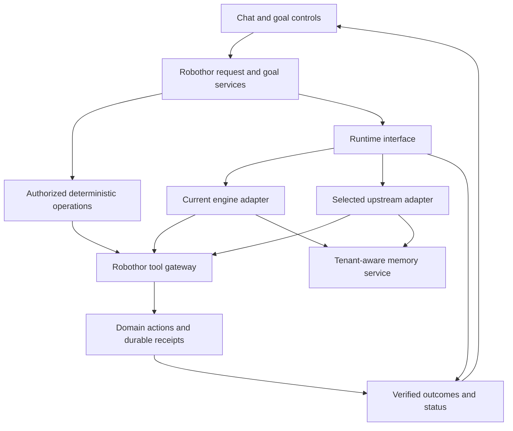

# Agent runtime modernization: implementation and decision plan

Status: proposed implementation plan. Date: September 20, 2026.

The planning work is complete; the implementation milestones below have not started. This plan does not select a replacement runtime or authorize a production rollout. Its supporting evidence is the [runtime research](../research/AGENT_RUNTIME_OPTIONS_2026-09-19.md), [capability assessment](../research/AGENT_CAPABILITY_PARITY_2026-09-19.md), and [interactive performance report](../runbooks/INTERACTIVE_REQUEST_PERFORMANCE.md).

## Outcome and priorities

Make everyday requests finish promptly, make ongoing work understandable and stoppable, preserve custom goals and memory, and make generic agent machinery independently upgradeable. The operator selected equal priority for everyday reliability and expanded long-running goals. The first product milestone must demonstrate both; existing goal behavior remains a mandatory compatibility requirement.

Successful delivery has four observable results:

- A routine action reaches a verified result or a bounded, explained stop. It does not continue investigating after success.
- Users can see whether work is running, waiting, blocked, stopping, or complete, including delegated work.
- Short-term, long-term and ongoing goals retain their authorization, persistence, budgets and completion rules across engine changes.
- A documented runtime interface and an automated compatibility suite make dependency upgrades repeatable.

## Architecture and ownership

The adapters are alternatives for a given run. They do not execute the same real action together. A confirmed deterministic operation keeps its bounded path through existing admission and operation persistence.

| Robothor owns | Runtime may supply |
|---|---|
| Request authority, tenant identity, manifests and permissions | Model/tool iteration, streaming and provider support |
| Goal records, child relationships, wake rules and budgets | Working plans and delegated execution primitives |
| Mutation claims, provider receipts and reconciliation | Context management and tool-result formatting |
| Business memory, provenance and tenant scope | Supported extension and skills interfaces |
| Outcome validation and user-facing status | Runtime-specific checkpoints and instrumentation |

Avoid running two nested agent loops, two competing compaction policies, or two independent delivery paths. In the upstream adapter, its loop replaces the current loop; it does not sit inside every iteration of it. Robothor retains domain policy. Choose the model-provider ownership boundary during the first spike so retries, fallback, reasoning replay and billing are counted once.

## First-release product scope: two equal priorities

The action track delivers a bounded draft/confirm/verify flow, accurate progress, effective stop controls and protection against repeated writes. The goal track delivers the following user workflows across short-term, long-term and ongoing goals. Where the current integration already implements a workflow, complete its product exposure and verification instead of rebuilding it.

| Goal expansion | User-visible acceptance |
|---|---|
| Goal workspace | See the objective, criteria, milestones/children, linked tasks, owner, status, next review/wake condition, budget and evidence from one view |
| Reviewable decomposition | Review and steer proposed child work and dependencies; changes remain within the parent's authorization and shared budget; ambiguous expansion waits for the operator |
| Manage work across days | Waiting goals sleep without model polling; due reviews and eligible events wake them; blockers and approaching due dates become visible through the existing authorized notification channel |
| Control the entire goal | Pause/cancel applies to relevant descendants; revise scope and renew budget explicitly; display which work has stopped and which external effect still needs reconciliation |
| Evidence and recurring progress | Inspect evidence per criterion and assessment period; independently validate supported outcomes; require review where judgment is needed; reject stale evidence after scope/period changes |

Example acceptance journey: create a generic monthly review goal, inspect its proposed agenda and follow-up children, steer one milestone, wait for a simulated response, pause the family, resume explicitly, then review evidence for the current period. Exercise this alongside an unrelated quick action to prove the long-running work does not monopolize the assistant.

This adds usability and depth to goal pursuit without giving it broader implicit authority. Arbitrary new connectors, autonomous spending, and a general visual workflow editor are separate scope. The first release requires the action and goal tracks to pass together; a replacement runtime is not required to deliver either.

## Milestone 0 — establish a reproducible baseline

Deliver one reviewed baseline manifest, a capability contract and acceptance flows for both product tracks before changing execution.

1. Record the current integration commit, deployed artifact, migrations, feature flags and relevant dependency versions. Record instance configuration privately; commit only generic fixtures and schema/version references.
2. Reconcile the earlier `6ffb95370d` source inventory with the current integration revision. The research checkout does not contain every later goal/autonomy addition; it must not become the implementation base by accident.
3. Inventory invocation paths: interactive chat, confirmed operations, scheduler, goal controller, workflows, delegated work and recovery. Assign each a policy and status owner.
4. Convert the capability assessment into stable requirement IDs and fixtures. Label each capability implemented, enabled, verified or unknown; do not infer these from one another.
5. Capture current timing and behavior using the same fixtures that candidates will receive. Include cold startup, warm requests, long history and background work.

Exit: a pinned baseline can reproduce the incident class and the corrected behavior without using a real meeting. Any existing defect is recorded explicitly; current failures are not accepted as the desired contract.

## Milestone 1 — build the contract and performance suite

Extend `bench/interactive/` rather than create an unrelated benchmark. The existing comparator only recognizes a limited runtime list and computes aggregate percentiles across cases. Add candidate registration, per-case results, explicit timeouts/failures, matched version/configuration cohorts, and raw timing events. Keep the prior fixture results as historical evidence.

Required contract cases:

| ID | Scenario | Required assertion |
|---|---|---|
| A01 | Prepare a draft, then confirm | Draft has no external effect; confirmation uses bound arguments and existing authority |
| A02 | Duplicate confirmation or concurrent requests | One committed effect per operation identity; payload changes do not silently reuse it |
| A03 | Provider accepts write, response is lost | Reconcile observed state; no blind write retry or premature success |
| A04 | Completion followed by a tempting extra task | No unrelated post-completion work |
| G01 | Short goal survives worker restart | Same authorized objective and attempt accounting; no implicit new goal |
| G02 | Long goal receives duplicate/out-of-order events | At most one eligible wake; timed fallback; zero model calls while waiting |
| G03 | Parent has unfinished children | Parent cannot complete; child usage reaches the goal-family ledger |
| G04 | Ongoing goal enters a new period | Fresh evidence required; old success cannot complete the new assessment |
| G05 | Pause, cancel, steer and exhausted budget | Controls reach descendants; resume/renewal requires existing operator authority |
| G06 | Stale worker continues after lease loss | Admission denies new effects; stale status cannot overwrite newer state |
| G07 | Decompose, revise and inspect a goal | Children/dependencies and evidence are visible; revisions retain history and do not silently expand authority |
| G08 | Due review, deadline and blocker | Next wake and blocker are visible; authorized notices are deduplicated and cannot turn into model polling |
| M01 | Memory retrieval and update across tenants | Correct tenant scope, provenance and existing lifecycle semantics |
| R01 | Crash before/after effect claim, receipt and checkpoint | Recover or explicitly require reconciliation; never infer success from prose |
| R02 | Model fallback and history compaction | Preserve current request, pending action identity, tool pairing and provider replay rules |
| U01 | Older persisted state under a new adapter version | Read or explicitly migrate supported state; refuse unsupported state clearly |
| V01 | Goal claims completion with invalid evidence | Criterion validator or required human review prevents false completion |
| L01 | Busy background goals while a user asks a simple question | Bounded interactive queue delay and eventual background service |

Use deterministic model/tool fixtures, isolated test databases and simulated time first. Cover process death and cancellation at each mutation boundary. Add real model cohorts only after these pass; model tests still use synthetic business tools. Fixture timing and provider billing must remain separate.

Proposed acceptance targets, to ratify against the measured baseline before evaluating candidates:

| Measure | Initial gate |
|---|---|
| Authority, tenant scope, duplicate effects and false success | All deterministic contract assertions pass; any observed violation blocks promotion |
| Harness overhead, warm simple request | p95 below 2 seconds, retaining the existing overhead gate |
| Simple conversational action | Target p95 at most 30 seconds in the chosen provider cohort; total deadline 60 seconds including retries, then a truthful bounded result |
| Confirmed deterministic action | Zero model calls, no post-completion tools, existing receipt checks pass |
| Status | Acceptance shown within 2 seconds p95; observed stage updated at least every 10 seconds during active work, including startup/queue time |
| Stop control | Durable stop acknowledgement within 2 seconds p95; gate denies new effects after stop is committed; descendants observe control within 5 seconds p95 |
| Replacement latency | At least 20% p95 improvement over optimized current engine for the agreed agent-loop workload; no critical case regresses more than 10% |
| Goal semantics and recovery | All goal, fault and upgrade contract cases pass; waiting produces no model polling |

These are proposed product/test targets, not measured claims or universal provider guarantees. Already-dispatched provider requests may finish after stop or deadline; retain and reconcile their records. Acknowledgement of a stop is distinct from complete worker termination. Background goals use their own budgets and wait policies, not the 60-second interactive deadline.

Run at least 30 repetitions per case for screening, then at least 100 per case for finalists with randomized execution order and uncertainty reported for p95. Match model/reasoning, tools, prompts, resources and warm/cold state. Record errors and timeouts rather than dropping them. Evaluate framework defaults in a separate cohort. This sample size is screening evidence, not a reliability certification.

Exit: repeatable per-case reports, fault assertions and a documented baseline. Benchmark fixes are useful even if the engine remains unchanged.

## Milestone 2 — put the current engine behind a small interface

Proposed package: `robothor/engine/runtime/`, subject to the current integration tree. Start with contracts and `current.py`; do not move the entire runner at once.

| Contract | Contents and rule |
|---|---|
| Run request | Request/run IDs, trusted tenant/principal, manifest snapshot, goal/attempt/lease binding, deadline, parent ID, input and budget handle; trusted fields originate outside model output |
| Runtime interface | Execute/resume a run and accept controls; return or stream typed events and an explicit terminal result |
| Tool gateway | Resolve allowed tool, validate arguments, perform existing admission, recheck live authority at dispatch, invoke domain handler and return typed result/receipt |
| Usage accounting | Idempotent usage events keyed by run and provider call; reserve shared budget before concurrent calls, settle actual usage, retain estimates when usage is unavailable |
| Control channel | Durable versioned pause/cancel/steer commands; descendants receive relevant controls; stale attempts cannot regain authority |
| State envelope | Runtime ID/version, envelope schema, configuration version and opaque checkpoint reference; business state stays in Robothor tables |
| Progress/result events | Run, parent, goal, stage, timestamps, usage, outcome/evidence references and error classification; distinguish runtime completion from verified business completion |

Preserve the order and meaning of existing admission checks. Include nested tool dispatch, plugins, code execution, MCP tools and spawned agents in the coverage audit. A framework's built-in tool cannot bypass our gateway to reach business credentials. Start candidates with only explicitly registered tools; add supported standard tools through the same policy boundary.

The goal controller currently calls `AgentRunner`, and goal binding is consumed in runner setup, tool dispatch, loop guards, verifier and completion logic. Thread an explicit context through the interface while retaining compatibility internally. A Python `ContextVar` is an implementation detail, not the cross-process contract.

Wrap current behavior first; then extract only the service seams required by the next adapter. Keep existing entrypoints working. Add tests before behavior changes according to the repository's TDD rules.

Exit: the current engine passes the suite through the new interface, produces equivalent outcomes, and remains inside its performance gate. No default runtime changes.

## Milestone 3 — compare small, bounded candidate integrations

Build Pydantic AI and Deep Agents adapters sequentially on separate implementation branches after the common interface lands. Both get the same minimal slice: one conversational task, one confirmed operation bypass, one delegated goal, and one restart/wait/control scenario. Do not port every integration during the experiment.

- **Pydantic AI:** use public tools/dependencies/capabilities; start with only necessary Harness features. Explicitly test goal-family budgets because children with separate usage limits have separate accounting. [Subagent documentation](https://pydantic.dev/docs/ai/harness/subagents/).
- **Deep Agents:** use public tools/middleware and a configured state backend. Test the lifecycle and resource requirements of background threads through its Agent Protocol server. Keep Robothor's business wake rules authoritative. [Background task documentation](https://docs.langchain.com/oss/python/deepagents/async-subagents).
- **OpenCode:** include a bounded SDK feasibility comparison for trusted context, gateway-only tools, cancellation and versioned sessions. Advance to the full benchmark if it passes these boundaries and remains a plausible general runtime or useful coding specialist. Its JavaScript SDK still needs a boundary to our Python services. [SDK documentation](https://opencode.ai/v2/docs/build/sdk/).

Pin exact releases and record the documentation/API generation used. Verify advertised capabilities against installed versions. If a required contract needs a core fork, document the smallest failing case and stop expanding that candidate. Pi and OpenAI Agents SDK remain reserves; reopen the shortlist only if these candidates fail or a concrete requirement changes.

Decision: retain current, adopt one candidate for a bounded workload, or adopt it as the general runtime. Correctness and goal parity are hard gates. The existing 20% replacement speed gate remains in force. A maintainability-only migration that cannot meet it requires a separate explicit decision explaining the tradeoff; it must not be presented as a speed improvement.

Compare maintenance using evidence: generic mechanisms retired, adapter size and coupling, dependency footprint, one demonstrated dependency upgrade, migration complexity, operating cost and developer setup. Do not choose by feature count or package popularity.

Exit: a decision record with raw benchmark artifacts, failed contracts, upgrade drill, operating topology and reasons for the choice. Retaining the improved current engine is a valid outcome.

## Milestone 4 — deliver both product tracks and prove capacity

Begin these product changes as soon as the shared interfaces stabilize in Milestone 2; runtime experiments do not block them. Bring both action and goal improvements through those interfaces so they benefit the selected runtime and the fallback:

1. Deliver the goal workspace and everyday action status together: queue/wait reasons, last observed action, elapsed time, budget, milestones/children, criteria/evidence and stop progress. Use execution events, not extra model calls. Add product/API acceptance tests for the first-release goal workflows, including reviewable decomposition, revisions and recurring assessments.
2. Add criterion-specific validators for the first supported action domains, reusing existing provider receipts and verifiers. Label human-assessed outcomes accurately.
3. Close gaps in the mutating-tool coverage inventory. Preserve existing calendar and effects records; do not merge their schemas as an incidental runtime refactor.
4. Add bounded queues, explicit overload behavior, interactive capacity reservation and background fairness only where the load results require changes. Preserve per-goal/tenant lease correctness while increasing worker count.
5. Audit optional features: portable skills/tools, context caching/compaction, richer plans, background delegation and evaluation hooks. Record user benefit, existing overlap, adoption path, latency cost and test before adding one.

Capacity experiments: 1, 5 and 20 concurrent synthetic tenants, each mixing interactive requests and ready/waiting goals; exercise noisy-neighbor and worker-loss cases for at least 30 minutes per level. These are laboratory levels, not advertised capacity. Record queue delay, throughput, provider limits, memory/CPU, database pools, lock waits and cancellation. Stop increasing load at the first gate failure and report the supported envelope. Separate fixture capacity from real-model provider capacity.

Exit: product behavior demonstrated end to end and capacity stated with its hardware/provider/configuration assumptions. The first-release goal expansion acceptance flows and everyday action targets both pass. Further goal features remain a prioritized backlog.

## Milestone 5 — controlled rollout and rollback

Deployment is a later reviewed step coordinated with the active deployment owner. Separate Git branches alone do not isolate services, database schemas, ports or credentials.

1. Land additive contracts and current adapter with existing behavior selected by default. Use normal migrations and the repository's deployment path.
2. Exercise candidates in an isolated environment. Replays/shadow runs use fixture tools without business credentials; never dual-execute production writes.
3. After selection, enable the candidate only for explicitly selected new sessions or test tenants. Pin each run/session to its runtime version. Leave active legacy goals and opaque checkpoints on their compatible runtime until a tested migration or natural boundary exists.
4. Start with read-only requests, then an explicitly scoped disposable action test, then a limited everyday-action cohort, then goal workloads after their wait/recovery behavior is exercised. No historical meeting repairs or automatic goal resumes are part of this rollout.
5. Require at least 24 hours and 200 eligible requests at each applicable traffic stage, plus the full contract suite. Goal promotion additionally requires an observed wait/wake/control cycle and simulated recurrence/restart coverage. Extend observation when traffic is insufficient.
6. Expand only when latency, outcomes, budget and stop behavior remain within gates. Record artifact, runtime/configuration versions, exposure, results and deployment owner at each stage.

Rollback triggers: any unauthorized/cross-tenant effect, duplicate write, false verified outcome, failed stop admission, lost goal state, or sustained latency/error gate breach. Disable new candidate admissions first. Stop affected work, preserve claims/receipts and reconcile uncertain outcomes. Route only eligible new work to the current runtime; do not automatically retry a failed candidate's action there. Keep compatible workers available for pinned sessions. Prefer additive migrations; never delete recovery state to make rollback appear clean.

## Delivery sequence and ongoing upgrades

Suggested review units, each on an isolated branch/worktree:

| Unit | Deliverable | Depends on |
|---|---|---|
| P0 | Current baseline and capability contracts | None |
| P1 | Benchmark/reporting and fault fixtures | P0 |
| P2 | Runtime types and current adapter | P1 |
| P3 | Tool, goal-control and usage boundaries | P2 |
| P4 | Pydantic adapter experiment | P3 |
| P5 | Deep Agents adapter experiment | P3 |
| P6 | OpenCode feasibility and runtime decision | P4/P5; feasibility may begin after P3 |
| P7a | Everyday action status, bounded completion and coverage gaps | P3; begin without waiting for runtime selection |
| P7b | Goal workspace, decomposition/control and evidence workflows | P3; equal priority with P7a |
| P7c | Selected adapter hardening | Runtime decision |
| P8 | Combined action/goal acceptance, load, upgrade and rollback drills | P7a/P7b/P7c |
| P9 | Staged rollout and retirement of replaced generic code | P8 and coordinated deployment review |

For a single implementer, alternate bounded action and goal slices after P3; do not finish the entire action track before starting goal expansion. No calendar estimate is committed before the baseline and first adapter establish effort. Re-estimate at P3 using actual coupling and failed contracts. Each unit should produce a reviewable result; if it grows into a broad rewrite, split it before proceeding. No parallel agent work is assumed or started by this plan.

Use isolated dependency environments, unique test database/schema and resource names, and no production secrets for experiments. Agree on shared interface changes before adjacent branches edit them. Rebase or rebuild against the accepted integration revision before each promotion; preserve the other agent's deployed features. One deployment owner controls the shared staging/production slot.

After adoption, schedule monthly upstream review and prompt review of security fixes. Dependency update PRs run contract, provider-compatibility, checkpoint migration and performance checks. Demonstrate one real pinned-version upgrade before promoting the new runtime. Publish supported versions and keep a known-good artifact. Retire duplicate generic machinery only after rollback no longer depends on it; retain the domain services and compatibility tests.

## Definition of done

A chosen runtime strategy is documented; everyday action targets, expanded goal workflows and goal compatibility contracts pass; the status/stop experience is demonstrated; capacity limits are measured; one upgrade and one rollback are exercised; operating ownership and compatibility policy are documented. If no candidate clears the gates, deliver the improved current engine and record why. Research completion alone is not engine modernization.
